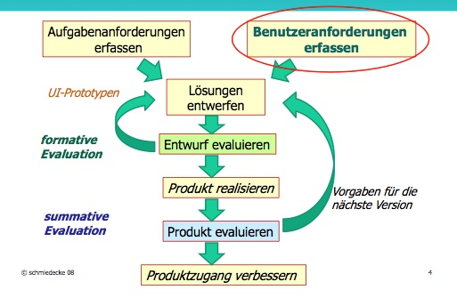
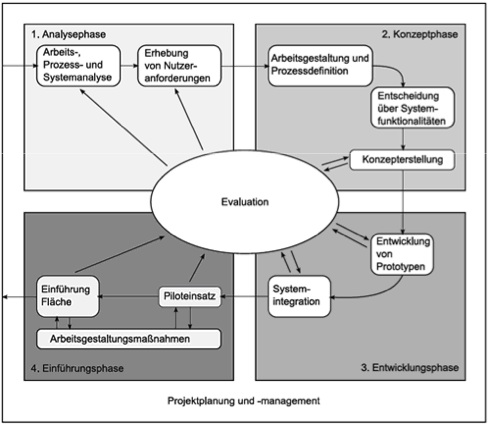
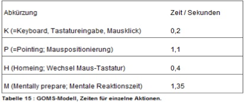
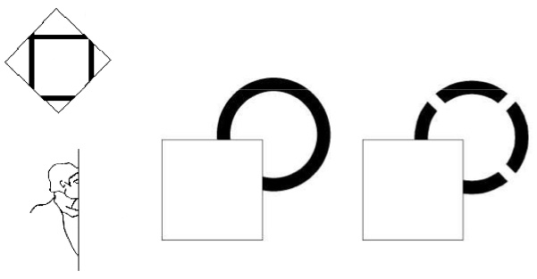
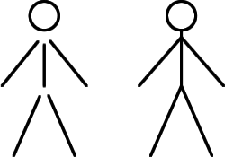

HCI Compilation
===============

Begriffe
========

**Chunking** = Aufteilung der Informationen in (7-er) Blöcke (7 wegen KZG)

**Effizienz** = Möglichst geringe Anzahl an Interaktionen, ressourcenschonend (z.B. Zeit)

**Effektivität** = Die Software tut dass was sie soll.

**HCI** = Die Lehre von der Qualität der Schnittstelle zwischen Mensch und interaktivem Gerät

**Heuristiken** = "Faustregeln" Werden dort eingesetzt, wo eine komplette Analyse zu aufwändig wäre.

**Kognition** = menschliche Informationsverarbeitung (Erkennen, Durchdenken, Anwenden...)

Usability / Gebrauchstauglichkeit
=================================

"Ist das Ausmaß, in dem ein Produkt

-	durch **bestimmte Benutzer**
-	in einem **bestimmten Nutzungskontext**

genutzt werden kann, um

-	bestimmte Ziele
-	**effektiv, effizient** und **zufriedenstellend**

zu erreichen."

Ziel ist eine **effektive und effiziente** Interaktion.

Kriterien
---------

-	Aufgabenangemessenheit
-	Lernförderlichkeit
-	Fehlertoleranz
-	Selbstbeschreibungsfähigkeit
-	Effektivität und Effizienz
	-	Tastenkürzel
	-	Expertenfunktionen
	-	Navigationspfade
	-	Transformationsdistanzen(Handlungsmodelle)
-	Normans 10 Heuristiken
-	Gestaltungsgrundsätze nach DIN 9241-110 ("ASSEFIL")
-	Shneidermans 8 goldene Regeln
-	Entlastung des Benutzers
	-	Entlastung der Augen
	-	Entlastung von KZG und LZG
	-	Fehlervermeidung und Korrekturunterstützung

warum Usabilty?
---------------

-	größere Akzeptanz
-	weniger Nachbesserungen
-	weniger Supportbedarf
-	Usabilty schafft Wettbewerbsvorteile
	-	Auf Messen gut vermittelbar
	-	Benutzerbewertungen in Foren etc.
	-	Awards

*Aber: Usability kostet! (Expertenevaluation (theoriebasiert) deutlich günstiger als Benutzerevaluation)*

User Experience / Nutzungserlebnis
==================================

Berücksichtigung weiterer Attribute:

-	motivierend
-	ästhetisch
-	unterhaltsam
-	kreativ
-	erfreulich
-	überraschend
-	hilfreich
-	unaufdringlich

Ziel ist eine **angenehme, effektive und effiziente** Interaktion.

---

Kategorisierung von Benutzern
=============================

Aspekte der Kategorisierung
---------------------------

-	Wissen und Erfahrung
-	Physische und psychische Grundfähigkeiten
-	Denken und Handeln, "Paradigmen"
-	Soziale Situation
-	Häufigkeit der Benutzung
-	Wichtigkeit der Benutzung
-	Freiwilligkeit der Benutzung
-	Grad der Selbstverständlichkeit der Benutzung
-	Soziale Wertigkeit der Benutzung
-	Alternativmöglichkeitn
-	Statusziele
	-	wie "cool" ist es die Software zu benutzen
-	...

Benutzerklassen (HCI)
---------------------

### Gelegenheitsbenutzer

-	Nutzen die Software in Einzelfällen
-	mit teilweise großem zeitlichen Abstand
-	Software kein zentraler Arbeitsgegenstand

Beispiele:

-	Käufer am Fahrkartenautomat
-	Nutzer der Onlinehilfe bei Druckerstörungen
-	Versicherungsnehmer bei Online-Vertragsabschluss

#### Anforderungen des Gelegenheitsbenutzers an die Schnittstelle

-	"Benutzer ohne Gedächtnis"
-	Hilfetexte, Assistenten, am besten kontextsensitiv
-	intuitiv, selbstbeschreibend benutzbar
-	Verhinderung von Eingabefehlern
-	Rücknahmemöglichkeit für jeden Schritt
-	Schneller Ausstieg

### Ungeübter Benutzer

-	Anfänger
-	wollen und müssen sich einarbeiten / lernen
-	Software ist Arbeitsgegenstand
-	Ziel ist gute Programmkenntnis und Routine
-	Fachwissen kann vorausgesetzt werden

Beispiele:

-	Neuer Mitarbeiter im Bereich (Lager, Disposition, Verwaltung...)
-	Alle Anwender nach Softwarewechsel

#### Amforderungen des ungeübten Benutzers an die Schnittstelle

-	vereinfachter Funktionsumfang für den Einstieg
-	Tutorials, Lernunterstützung
-	Unterstützung des Learning-by-Doing durch Hinweise
-	Unterstützung beim Erwerb eines korrekten mentalen Modells vom System

### Routinebenutzer

-	Erfahrung durch regelmäßige intensive Programmnutzung für gleichartige Aufgaben
-	gesichertes Verständnis des Programms
-	evtl. Kenntnis nur eines Teils des Programms
-	Effektivität und Effizienz der Arbeit steht im Vordergrund
-	nicht unbedingt am Weiterlernen interessiert
-	hassen Veränderungen, denn das macht sie wieder zum Anfänger

#### Amforderungen des Routinebenutzers an die Schnittstelle

-	schneller Programmstart
-	bekannte Funktionen möglichst effizient anbieten (Shortcuts)
-	Individualisierbarkeit
-	Hinweis auf Neuerungen
-	stabile Benutzerschnittstelle

### Experte

-	Interesse am Programm über den unmittelbaren Arbeitszweck hinaus
-	Freude am Erkunden neuer Funktionen und Möglichkeiten
-	Systematische Versuche
-	Kenntnis der internen Dateistruktur

Beispiele:

-	Supportmitarbeiter
-	Freaks

#### Anforderungen des Experten an die Schnittstelle

-	erkennbares, stimmiges implementiertes Modell
-	Unterstützung bei der systematischen Erkundung
-	spezielle Hilfe oder Fachbücher, Foren
-	zusätzliche Konsolenschnittstelle sehr beliebt

Benutzerprofile
---------------

-	charakterisieren Benutzergruppen
-	Aggregation eines Benutzerspektrums (eines Systems)
-	jeder (wichtige) Benutzer sollte einem Profil zuzuordnen sein
-	besonders wichtig: die "Randgruppenprofile"
-	sind wichtig:
	-	im Interaktionsentwurf
	-	bei der Evaluation (z.B. Auswahl der Testbenutzer)
	-	aber reichen als Beschreibung nicht aus
-	werden weiter durch **Personas** beschrieben
-	sind schematisch, keine Empathie

Profile sollten nach dem Aggregationskriterium benannt werden, z.B. Berufsnutzer, junger Poweruser, ausländischer Dauernutzer... *(Poweruser, Verwalter, Konvertierer, Sucher)*

übliche Kategorien eines Benutzerprofils:

-	Benutzerklasse
-	Computererfahrung, Kenntnis anderer Anwendungssysteme
-	Fachkenntnis
-	Rolle im Anwendungsbereich, Statusaspekt
-	Häufigkeit der Benutzung, Wertigkeit der Benutzung
-	Menge, Umfang und Bedeutung der Aufgaben am System
-	körperliche Fähigkeiten / Handicaps / Altersgruppe
-	weitere Kenntnisse (Sprachen...)

**möglichst grobe Bewertungsskalen zur Typbildung verwenden:** z.B. "täglich / wöchentlich / gelegentlich / selten"

Personas
--------

-	künstlich konstruierte, fiktive Benutzer, aus erhobenen Daten konstruiert
-	**illustrieren einzelne Benutzerprofile**
-	benannt, am besten auch mit Bild (macht Persona lebendig)
-	schaft handhabbare Begrifflichkeit, Identität
-	eher auf Stimmigkeit / Glaubwürdigkeit zu überprüfen als ein Benutzerprofil
-	"fokussiertes Soziogramm"

Beispiele weiterer Aspekte:

-	Soziale Einbettung, Wohnform
-	Hobbies, Vorlieben, Ärgernisse
-	typischer Tagesablauf
-	wichtige Einschnitte
-	Technologiebezug allgemein
-	Technologienutzung am konkreten Beispiel

User Stories
------------

-	beschreiben situationsbezogene Benutzeranforderungen
-	Anwendungswunsch aus der Sicht **eines** Benutzers
	-	wer will
	-	wann und warum
	-	was tun?
	-	"hätte gern", "wünscht sich", "stört sich an", "versteht nicht"
-	*"letzten Monat wollte Karl..."*
-	leiten sich aus realen Benutzungssituationen bzw. -wünschen ab
-	keine Vorgabe zu Form und Inhalt
-	können **Personas** zugeordnet werden

Beispiel:

> Fritz war gestern im Theater und hatte sein Handy nicht ausgestellt. Als es klingelte, hat er vor Aufregung sehr lange gebraucht, bis er es zum Schweigen gebracht hatte. Peinlich!

### Vorteile von User Stories

-	Karteikartenformat, kleine Einheiten
-	leicht zu sortieren (nach Priorität, Schwierigkeit)
-	leicht zu kommentieren
-	ergeben direkt Testfälle

### User Stories vs. Use Cases (Anwendungsfälle)

User Stories haben im Gegensatz zu Use Cases keine vorgegebene Form und bieten die Möglichkeit einen Anwendungsfall leichtgewichtiger und agiler zu modellieren.

---

Usability Engineering
=====================

Usability-Engineering-Zyklus
----------------------------

-	**Anforderungen** aus Nutzungszweck und -kontext erfassen
-	**Anforderungen** der Benutzergruppen erfassen
-	**Gesamtlösungen** entwerfen
-	Lösungsentwürfe gegenüber Anforderungen **evaluieren**
-	**Iterieren**, bis das Evaluationsziel erreicht ist.

Phasen des Usability Engineering
--------------------------------

### 1. Analysephase

Analyse der Benutzeranforderungen parallel zur funktionalen Systemanalyse

-	Welche **Benutzer**?
-	Welche **Aufgaben**, welches **Fachwissen**?
-	Welche **Häufigkeit**?
-	Welche **Zielvorgaben**?
-	Welche **Daten, Dokumente** und **Arbeitsmittel**?
-	Welche **Aufgabenverknüpfungen**?
-	Welche **Benutzerkommunikation**?
-	Welche **Fehlersituationen**?
-	Welches **Arbeitsumfeld**?
-	Welche **Hardware** oder **Zusatzsoftware**?

**Ergebnisse** der Analysephase sind

-	Protokolle
-	Personas
-	Prozessbeschreibungen

bzw. wie viele

-	Benutzerklassen
-	Einsatzgebiete
-	Sprachen...

es gibt.

### 2. Konzeptphase / Konzeptionsphase

Interaktionsneutrale Konzeption der Systemfunktionalitäten (Use Cases)

#### Use Cases / Anwendungsfälle

-	klassische Anforderungsmodellierung
-	umfassend, durchdacht und konstruiert, abgeschlossen
-	aus der Aufgabenstellung abgeleitet

#### Interaktionskonzeption und -Evaluation

-	Kartenmodell (Card Sorting)
-	Papierprototypen (Fokusgruppen)
-	genereller Prototyp (Click-Mockup) für Usability-Test

#### Fragestellungen

-	Interaktionsmöglichkeiten für **häufige** Aufgaben
-	Interaktionsmöglichkeiten für **seltenere** Aufgaben
-	**Abhängigkeiten** zwischen den Aufgaben
-	**Zeitliche Verfügbarkeit** der erforderlichen Informationen
-	**Metaphern** und ähnliche Systeme
-	Einbindungsmodus für (spätere) **Add-ons** und Module
-	**Prozess- und Arbeitsplatzänderungen**

### 3. Entwicklungsphase

-	Implementierungen des Papierprototypen oder Click-Mockups
-	**Evaluationstechnik** = Expertenevaluation

### 4. Einführungsphase

-	Pilotbetrieb

	-	Usabilty-Tests mit Benutzern
	-	Fragebögen
	-	Interviews

-	Nutzung der Ergebnisse

	-	Verbesserung der Schulungsmaterialien
	-	Verbesserung der Hilfetexte
	-	Bereitstellung von Service-Packs bzw. Updates mit kleinen Funktionserweiterungen
	-	Verbesserung der Marketingmaterialien
	-	Anregungen für die nächste Version des Systems
	-	Anregungen für weitere Add-Ons und Module

Evaluation
==========

Voraussetzungen
---------------

-	Definiertes Ziel
-	Definierte Annahmen
-	Definierte Methodik
-	Klares Kosten-Nutzen-Verständnis

Einordnung in den Entwicklungsprozess
-------------------------------------

### formative Evaluation

> Hier findet am meisten HCI statt

-	Evaluation eines **geplanten** Produkts
-	Entwurfs- und Entwicklungsbegleitend

### summative Evaluation

> Bilanz über alle Features

-	Evaluation eines **fertigen** Produkts
-	Einhaltung der geforderten Usability-Qualität

Evaluationstechniken
--------------------

### Überblick

-	Theoriebasierte Evaluation

	-	Informationsanalyse
		-	Dokumentenanalyse
			-	Styleguides, Schulungs- und Marketingmaterialien
			-	Supporttickets und -protokolle
		-	Datenanalyse
			-	Logdateien
			-	Clickstreams
			-	Eyetracking-Protokolle
	-	Expertengutachten *(deutlich günstiger als Benutzerevaluation)*
		-	Heuristische Evaluation
		-	Cognitive Walkthrough

-	Benutzerbasierte Evaluation

	-	Befragung
		-	Umfrage
		-	Interview
	-	Usability-Test (im Labor)
		-	Videoaufzeichnung
		-	Logging
		-	Eyetracking
		-	Think-Aloud
	-	Beobachtung (vor Ort)
		-	(Feld-)Studie
		-	Ethnographie

### Heuristische Evaluation (nach Nielsen)

-	**Mehrere Usabilty-Experten** bewerten ein System aufgrund einfacher und allgemeiner Heuristiken. **Einfach und kostengünstig!** Es ist jedoch **einiges Anwendungswissen nötig.**

-	Einsatz auf Mockups, Prototypen oder Fertigsystemen

-	Bewertung anhand vorgegebener Ziele

	-	Erlernbarkeit
	-	Fehlerbehandlung
	-	Funktionalität
	-	Frustration...

-	*Mit 5 Evaluatoren / Evaluationen werden 75% der Mängel gefunden*

#### Ablauf

1.	Input sammeln
2.	Evaluation des Systems
3.	Sammeln und Auswertung
4.	Bewerten der Ergebnisse

#### Benutzbarkeitsheuristiken nach Nielsen:

(Erklärungen aus [http://glossar.hs-augsburg.de/Heuristische_Evaluation)](http://glossar.hs-augsburg.de/Heuristische_Evaluation)\) (Andere Heuristiken möglich, z.B. Gestaltungskriterien nach ISO 9142-110...)

##### 1. Sichtbarkeit des Systemstatus

Das System sollte dem User mit angebrachten Infos fortwährend mitteilen was geschieht.

##### 2. Übereinstimmung zwischen System und der realen Welt

Das System sollte in Wort und Phrase die Sprache der Anwender sprechen und nicht zu systemorientiert sein

##### 3. Benutzerkontrolle und Freiheit

Da User öfter mal Fehler machen, sollte das System hierfür "Emergency Exits" haben, sowie Undo- und Redo-Funktionen

##### 4. Konsistenz und Einhaltung von Standards

Das System sollte Konsistent sein und bestimmten Standards folgen, damit sich der User immer zurechtfindet

##### 5. Fehlervermeidung

Besser als jede gute Fehlermeldung ist die Vermeidung von Fehlern

##### 6. Wiedererkennen anstelle von Erinnern

Die Bedienung sollte soweit es geht selbsterklärend sein ohne das sich der User groß erinnern muss. Auch sollte er sich nicht Informationen von einem Dialog für einen anderen merken müssen.

##### 7. Flexibilität und Effizienz

Für erfahrene User sollte es Abkürzungen geben die das Arbeiten mit dem System beschleunigen. Die „Shortcuts“ sollten allerdings Anfänger nicht verwirren. User sollten sich auch von ihnen häufig verwendete Funktionen speziell zurechtlegen können.

##### 8. Ästhetisches und minimalistisches Design

Dialoge sollten notwendige Informationen enthalten. Jede zusätzliche Information lenkt nur von den Fakten ab und hält den Benutzer auf.

##### 9. Hilfe für den Benutzer um Fehler wahrzunehmen, zu erkennen und zu beheben

Fehlermeldungen sollten in verständlicher Sprache sein, das Problem genau beschreiben und Lösung vorschlagen

##### 10. Hilfe und Dokumentation

Selbst wenn der User für die Nutzung des System keinerlei Unterstützung bedarf, sollte es doch, gerade bei komplexen Interfaces, gute Dokumentation geben die in die Struktur integriert sind. Eine Hilfe an entsprechender Stelle sollte sowohl kontextabhängig als auch verständlich verfasst sein und konstruktive Lösungsansätze bieten.

### Cognitive Walkthrough

-	Benutzbarkeits-"Gedankenexperiment"
-	naives Benutzerverhalten verschiedener **fiktiver Benutzer (Personae)**
-	Experten durchlaufen stellvertretend alle Aktionen
-	Versuch, Probleme stellvertretend zu identifizieren
-	Durchführung ausgewählter Szenarien anhand eines konkreten Testplans
-	systematisches Protokoll

#### Vorbereitung

-	Detaillierte Beschreibung der **Personae** und **Szenarien**
-	Liste der möglichen Aktionen / Lösungswege
-	Mockup / Prototyp / Installation des Systems

#### Arbeitsannahmen

-	Benutzer sucht die erforderlichen Funktionen
-	Benutzer ist frei in der Wahl der Funktionen

#### Fragen

-	Auffindbarkeit der Funktionen
-	Handhabbarkeit des Systems
-	Verständnis des Feedbacks

### Benutzerstudie

Vorbedingungen:

-	Nutzerauswahl
-	Ziel der Studie
-	Festgelegte Methodik
-	Definierter Evaluationsprozess
-	Metriken und Auswertungsverfahren: Quantifizierbarkeit?
-	Qualität: Pilottest <--> Untersuchung

#### Beobachtung

-	im Labor oder in der realen Umgebung
	-	**reale Umgebung**: Feldstudie, Ethnographie
	-	**Labor**: Usability-Experiment
-	Beobachtung liefert primär qualitative Ergebnisse
	-	mathematische oder systematische Auswertung kaum möglich

Die Datensammlung erfolgt durch:

-	Notizen
-	Fotos
-	Tonaufnahmen
-	Videos
-	Materialsammlung
-	viel Datenmaterial

grundsätzlich ist alles sammelnswert.

##### reale Umgebung: Feldstudie

-	**strukturierte Beobachtung**
-	Ziele und Beobachtungsgegenstände vorher festlegen
-	strukturieren, Kategorien bilden, z.B.
	-	Jugendliche, Erwachsene, Senioren
	-	Orientierung, Anfrage, Geschäftsabschluss
	-	Frühschicht, Mittelschicht, Spätschicht
-	Erhebungsbögen vorbereiten
-	Platz für freie Beobachtungen lassen
-	**Voraussetzung:** gute Vorkenntnisse über das Einsatzgebiet

Vorteile der Feldstudie:

-	gezielt und effektiv
-	gut durchzuführen
-	wiederholbar
-	Ergebnis garantiert

##### reale Umgebung: Ethnographie

-	**unvoreingenommene Beobachtung**
-	keine im voraus festgelegte Struktur
-	Beobachter betrachtet alles als "fremd"

Vorteile der Ethnographie:

-	vorurteilsfrei
-	unerwartetes wird entdeckt
-	natürliche Strukturen werden erkennbar

##### Beobachtungstechniken

-	Beobachtungsprotokoll
-	Videoaufzeichnung
-	Software-Log
-	Think-aloud-Protokoll
-	Ethnographie
	-	"Eindrücke aus der Beobachtung?"

#### Befragung

##### Generelles

-	Fragen sehr sorgfältig vorbereiten, weniger ist mehr
-	Testen mit Testbenutzern (Verständlichkeit, Umfang, Motivation)
	-	Testauswertung führt zur Präzisierung der Fragen
-	Zielgruppe wählen
-	**Zielfrage: Was will ich herausbekommen?**

##### Umfrage / Fragebogen

-	Große Probandenanzahl
-	Mischung aus geschlossenen und offenen Fragen
-	muss selbsterklärend sein
-	anonym
-	schafft große Datenbasis
-	Gut auszuwerten
-	Nachhaken nicht möglich

##### Interview

-	Besonders aufwändig
-	kleine Probandenzahl
-	**sehr gute Ergänzung zur Umfrage**
	-	oft zur Verifikation oder Präzisierung **nach einer Umfrage** oder Beobachtung
-	Mischung aus vorstrukturierten und spontanen Fragen
-	muss gut strukturiert und kurz sein
-	präzise Planung
-	begrenzter Themenbereich
-	Auswertung aufwändig

---

Benutzerfähigkeiten
===================

Arten
-----

-	Primär
	-	Sehen
	-	Motorik
	-	Gedächtnis
-	Sekundär
	-	Hören
	-	Sprechen
-	Spezialisiert
	-	Musikalische Fähigkeiten (Midi-Einspielungen)
	-	Graphische Fähigkeiten (Feinmotorik am Tablett)
	-	Handwerkliche Fähigkeiten

Gedächtnis und Kognition
------------------------

-	Gedächtnisforschung ist Teil der Psychologie
	-	daher "psychische Benutzereigenschaft"
-	**Gedächtnis ist zentral für die Interaktion**
	-	keine **Interaktion** ohne **Kognition**
	-	keine **Kognition** ohne **Gedächtnis**

**Kognition** steht für die menschliche Informationsverarbeitung (Erkennen, Durchdenken, Anwenden...)

### Das Gehirn

-	vegetative Prozesse
-	Sinneswahrnehmungen
-	unbewusste Denkprozesse
-	bewusste Denkprozesse

### Gedächtnisarten

#### Sensorisches Gedächtnis

-	"Kurzzeit-Sensorik-Speicher"
-	ikonischer Speicher (12 Chunks, 0,5 sec Persistenz)
	-	visuelle Informationen
-	echoischer Speicher (bis 5 sec. Persistenz)
	-	auditive Informationen

##### Filter

**Filter für Übergang in KZG:** Lenkung der Aufmerksamkeit

**Wahrnehmungsfilter: Prägnanz**

-	Es ist kein Dauerreiz (Sensorischer Filter)
-	Reiz passt in den aktiven Kontext (KZG)
-	Es gibt Vorwissen zum Reiz (LZG)

#### Kurzzeicht-Gedächtnis (KZG)

-	Arbeitsgedächtnis / "Arbeitsspeicher"
	-	Planung und Orientierung im Handlungsprozess
-	**klein:** 7 +/- 2 Chunks
-	**flüchtig:** 15-30 sec.
-	störungsanfällig
-	Informationsverlust durch Überlastung
-	auffrischbar durch Wiederholung

**Filter für Übergang in LZG:** Lernen

##### Das KZG und Interaktion

-	Warum ist bei der Gestaltung von Dialogen eine **Überlastung** des KZG zu **vermeiden**?
	-	*störungsanfällig*
-	Warum ist es wichtig, längere Menüs oder Listen zu **gruppieren**?
	-	*Chunking zur Unterstützung des KZG*
-	Warum sind **optische Gruppierungen** besser als nur Überschriften im Textfluss?
	-	*Chunking, unterstützt durch die Wahrnehmung (Gestaltgesetze)*

#### Langzeicht-Gedächtnis (LZG)

-	Unbegrenzte Kapazität und Persistenz (100 TB)
-	Assoziatives Wissensnetz
-	Zugriffszeit 8 sec. / Chunk
-	Zugang zum Wissensnetz via **Recall / Recognition**

##### Assoziationen

Der Zugriff auf Informationen findet über Assoziationen statt. Assoziationen sind sozusagen der Schlüssel zu Informationen.

-	je mehr
-	je neuer
-	je frequentierter

diese Schlüssel sind, desto besser lassen sich die verknüpften Informationen abrufen. Schlüssel kann man verlegen, aber gute Schlüsselanhänger sind z.B. Eselsbrücken, Klänge, Bilder, Emotionen. (sind eigentlich wiederum eigene Schlüssel). Assoziationen verblassen, sind aber reaktivierbar.

###### Recall

Aktive Suche nach Assoziationen.

###### Recognition

(Re-)Aktivierung von Assoziationen.

##### ACT-Modell

"Adaptive Control and Thought" - Geht davon aus dass das LZG in einen **Deklarativen** und **Prozeduralen** Teil unterteilt ist.

*Prozedurale Inhalte sind leichter abrufbar als deklarative.* -> Learning by Doing

###### Deklaratives Gedächtnis

-	Fakten
-	Konzepte, Modelle
-	Erlebnisse

###### Prozedurales Gedächtnis

leichterer Zugang

-	Abläufe
-	Klänge, Farben
-	Emotionen

### Konzentration

Konzentration bedeutet **Bündelung der Aufmerksamkeitsressourcen**

-	zielgerichtet koginitiv arbeiten
-	optimale KZG-Leistung
-	keine (wirksame) Störung

**Bündelung der Aufmerksamkeitsressourcen ist Arbeit!** Erleichterung durch:

-	KZG-Entlastung
-	Störungsvermeidung

### Lernen

Ist die gezielte **Assoziationsbildung** und "-pflege". (Wiederholung, Eselsbrücken, alternative Darstellungen)

-	Nutzung der **rechten Hirnhälfte**
	-	prozedurales Gedächtnis, Affekte...
-	Unterstützung der **linken Hirnhälfte**
	-	gute, logische Strukturen -> klares mentales Modell

Visuelle Wahrnehmung
--------------------

Das **Sehvermögen** ist rein physisch, während die **visuelle Wahrnehmung** als ganzes ein zum Teil kognitiver Prozess ist.

Die **visuelle Wahrnehmung ist:**

-	**Unbewusste** Vorverarbeitung
-	Erkennen bekannter **Strukturen**
-	**Vorsortierung** der visuellen Information
-	Unterdrückung von **Dauerreizen** (Hintergrundstrukturen)

### Das Auge

-	Sehfeld zentral unterhalb der Mitte
-	Schärfelücke am seitlichen Rand
-	Farbwahrnehmung ist adaptionsabhängig
	-	Farben sind nur bei Helligkeit wahrnehmbar
	-	"nachts sind alle Katzen grau"
	-	Adaption und Farbwahrnehmung "altern" deutlich

#### Probleme mit Farbe

Weniger als 5% der Sehzellen sind Zäpfchen (Farbsehen)

Farben werden unterschiedlich fokussiert. Das führt zu einem Schärfeproblem. **Blau wird am stärksten gebrochen, Rot am wenigsten. Daher niemals Blau-Rot Kontrast einsetzen!**

Ausserdem sollte eine Darstellung auch immer in s/w erkennbar sein (hoher s/w Kontrast). 

Kräftige Farben und hohe Kontraste können zu einem **komplementärfarbigen Nachhall** führen. Dieser ist unangenehm und zu vermeiden.

Ebenfalls benötigen **feine Strukturen einen hohen S/W Kontast**.

#### Sehfeld

Das **zentrale Sehfeld** sollte **optimal ausgenutzt** werden. Der **untere Rand** eignet sich gut für **Statusmeldungen/Infos.**

#### Eingeschränktes Sehvermögen

-	aufgrund von Alterung / Erkrankung / Sehschwäche
-	aufgrund von Umgebungsbedingungen
-	Kontrast gleicht Schärfemangel aus
-	Möglichst keine Farbschrift, niemals auf farbigem Hintergrund
-	**Rot-Grün Kontrast vermeiden, niemals zentral sinntragend einsetzen!**
-	Adaption entlasten
-	zentrales Sehfeld optimal nutzen

Hören
-----

-	Ohren sind
	-	nicht ausrichtbar
	-	nicht schließbar
-	akustische Reize sind immer da und mischen sich
-	Geräusche summieren sich zu Lärm
-	Für "Normalnutzer" vorbehalten für wenige wichtige Signaltöne
-	Für blinde Nutzer das Hauptmedium
	-	Mischung zwischen vorgelesenen Inhalten und akustischen Inhalten oft schwierig
-	In bestimmten Nutzungskontexten vorrangig (Navi)
-	**akustische Elemente sparsam einsetzen!**

Motorik (Hände)
---------------

Eingabe über Handmotorik (Tastaturen und Zeigegeräte).

Die Alternative dazu wäre Sprach- Ein/Ausgabe für:

-	Menschen mit Behinderungen
-	Bedienug während manueller Arbeit
-	in Situationen, in denen eine manuelle Bedienung nicht geeignet ist
	-	Lebensmittelverarbeitung, Diagnostik

### Effizienz von Eingaben

#### Fitt´s Law

Aufwand der **Mauspositionierung** hängt von **Mausweg** und **Größe des Ziels** ab

> "...Es besagt, dass die benötigte Zeit, um eine Zielfläche zu erreichen, eine Funktion der Distanz zu dieser Fläche und deren Größe ist. Erreichen bedeutet hier, einen motorischen Akt, z.B. das Berühren eines Punktes mit der Hand, dem Finger oder einem Stift – zu Zeiten Fitts'..." - [wikipedia](http://de.wikipedia.org/wiki/Fitts’_Gesetz)

#### Hick´s Law

Der **Aufwand einer Auswahl** hängt von der Zahl der **Entscheidungsschritte** und der Zahl der **Alternativen** ab.

#### GOMS-Aufwandseinschätzung

Goals, Operators, Methods and Selection Rules

### Tastaturinteraktion - Mausalternativen

-	**Funktionstasten**
	-	**\+** Beschleuniger
	-	**\-** Lernaufwand, reduzierbar durch Belegungsaufkleber, Mousepads...
-	**Tastenkombinationen**
	-	**\+** Mnemonik möglich --> LZG-entlastend
		-	Mnemonik bedeutet in diesem Fall z.B. ein Buchstabe zur schnellen Auswahl eines Eintrags aus einem Menü
	-	**\-** einige Kombinationen sind motorisch schwierig
-	**Navigation: Cursorblock, Pfeiltasten, Tabulator**
	-	**\+** effizient, sollten immer als Alternativen angeboten werden
	-	**\+** auch aus Gründen der Barrierefreiheit

---

Interfacegestaltung
===================

Generelles
----------

### Benutzerorientierte Gestaltung

-	**Zielgruppenorientierung**
	-	Benutzerprofile und Personas
	-	Kommunikationsparadigmen
	-	zielgruppengerechtes konzeptuelles Modell (Vorwissen, Fachlichkeit)
-	**Orientierung am Benutzungskontext**
	-	Einsatzsituation(z.B. Staub, Lärm, Ablenkung, Zeitdruck, Kritikalität)
	-	Art der Geräte (z.B. Bildschirmgröße, Touch oder Maus)
	-	Auswahl geeigneter Interaktionshardware und -formen
-	**Einbeziehung der Benutzer (oder Orientierung an Personas)**
	-	Menü- und Funktionsstruktur (Card Sorting)
	-	Entscheidung über primäre und sekundäre Funktionen
	-	Verständliche / fachgerechte Struktur und Naviation
	-	Vorerfahrung mit anderer Software, Vorlieben
-	**Barrierefreiheit**

### Allgemeine Gestaltungsregeln

-	**Gleichförmigkeit** der Gestaltung
-	Sichtbarkeit des **Systemzustands**
-	**Affordanz** (und nicht-Modalität)
	-	> "...ist die von einem Gegenstand – offensichtlich vorhandene oder tatsächlich gegebene – angebotene Gebrauchseigenschaft für Subjekte (Mensch oder Tier)..." [wikipedia](http://de.wikipedia.org/wiki/Angebotscharakter)
-	deutliche **Strukturierung**
-	**Chunking** durch Schichtenbildung
-	gut entschlüsselbare **Informationscodierung**
-	offener Text (falls Text nötig)
-	hinreichend große, gut unterscheidbare Bedienelemente
-	keine Mauskilometer
-	WIMP-Kriterien
	-	**W** indows
	-	**I** cons
	-	**M** enus
	-	**P** ointing device
-	**harmonischer Farbeinsatz**

#### Gestaltung mobiler Anwendungen

-	**responsive** Design
-	verständliche Struktur und Navigation
-	möglichst viele **natürliche Gesten** (ohne visuelle Kontrolle)
-	Eingabe durch Auswahl
-	**Vermeidung** von **Texteingabe**
-	Gestaltung an die Plattform angepasst
-	Möglichst alle Bedienmodi gut unterstützen
	-	Portrait, Landscape
	-	Single-Handed, Double-Handed, Cradled

### Text

-	Text muss immer **hinreichenden Schwarz-Weiß Anteil** haben *Ich schätze sie mein Kontrast*
-	**Positivdarstellung** im hellen Raum
-	**Negativdarstellung** im dunklen Raum
-	Monitor als **Lichtquelle** nicht unterschätzen!

Gestaltgesetze
--------------

### Gesetz der Nähe und Ähnlichkeit

#### Nähe

*Dinge, die räumlich nahe beieinander liegen, werden von unserer Wahrnehmung gruppiert, also als zusammengehörig aufgefaßt. Dinge, die weit voneinander entfernt liegen, werden als getrennt und unabhängig wahrgenommen.* - [kommdesign.de](http://www.kommdesign.de/texte/gestaltpsychologie1.htm)

**Bsp:**

-	Eingabefelder und Beschriftung nahe zusammen
-	Gruppierung (Chunking) von zusammengehörigen Informationen durch Nähe
-	Trennung von unterschiedlichen Informationen durch Abstand

#### Ähnlichkeit

*Dinge, die ähnlich sind, werden von unserer Wahrnehmung gruppiert, also als zusammengehörig aufgefaßt. Umgekehrt werden Dinge, die sich in wichtigen Merkmalen unterscheiden, als voneinander getrennt oder unabhängig wahrgenommen.* - [kommdesign.de](http://www.kommdesign.de/texte/gestaltpsychologie1.htm)

**Bsp:** Ähnliche Buttons für Menüs.

**Negativbeispiel:** Wenig Unterschied zwischen Link und Text, kein Unterschied erkennbar und wird als eins wargenommen.

### Gesetz der Geschlossenheit und Fortsetzung

#### Geschlossenheit

*Dinge mit geschlossenem Umriss oder Elemente, die von einer Linie umfaßt sind, werden von unserer Wahrnehmung gruppiert, also als zusammengehörig aufgefaßt. Dinge, die durch Linien getrennt sind, wirken nicht zusammengehörig.* - [kommdesign.de](http://www.kommdesign.de/texte/gestaltpsychologie1.htm)

#### Fortsetzung

*Dinge, die auf einer durchgehenden Linie oder Kurve angeordnet sind, werden von unserer Wahrnehmung gruppiert, also als zusammengehörig aufgefaßt.* - [kommdesign.de](http://www.kommdesign.de/texte/gestaltpsychologie1.htm)

### Gesetz der Guten Form / Gestalt (Prägnanz)

*ede Figur wird als möglichst einfache Struktur interpretiert. Die Wahrnehmung hat also eine Eigentendenz zu »Guten Gestalten«* - [robaweb.de](http://www.robaweb.de/gdm/inhalt/VisuelleWahrnehmung/Gestaltwahrnehmung/03-Gestaltgesetze.html#GesetzDerGutenGestalt)

> "...Die klassische Gestaltpsychologie formulierte mehrere Gestaltgesetze der Wahrnehmung. Eines davon ist das Gesetz der Prägnanz. Es besagt, dass in einer Vielzahl von Elementen jene zuerst wahrgenommen werden, die sich in einer oder mehreren Eigenschaften von den anderen abheben. In diesem Zusammenhang ist der Begriff Prägnanz mehr im Sinne von „Hervorgehobensein“ oder „Auffälligkeit“ zu verstehen..." - [wikipedia](http://de.wikipedia.org/wiki/Prägnanz)

Kommunikationsparadigmen
========================

Als was erscheint mir der Computer?
-----------------------------------

-	Computer als **Arbeitsmittel (Ressource)**
	-	der Mensch setzt den Computer ein
-	Computer als **Werkzeug (Funktion oder Automat)**
	-	der Mensch bedient den Computer
-	Computer als **Kommunikationspartner (Assistent, Partner, Überwacher oder Ausführender)**
	-	der Mensch kommuniziert mit dem Computer
-	Computer als **Medium (Mittel zur Anwendungswelt)**
	-	der Mensch interagiert mit über den Computer
-	Computer als **künstliche Realität (der Computer wird unsichtbar)**
	-	der Mensch bewegt sich in einer künstlichen Welt
